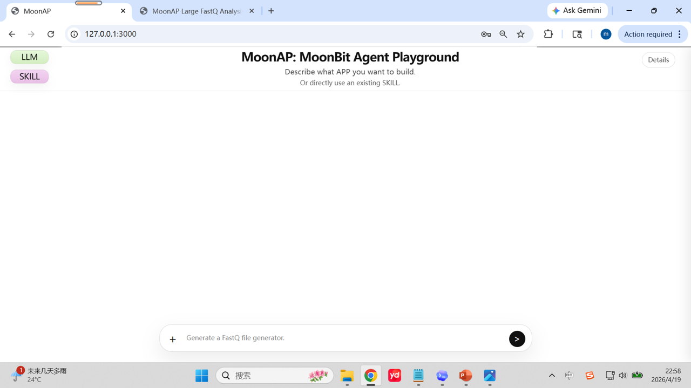
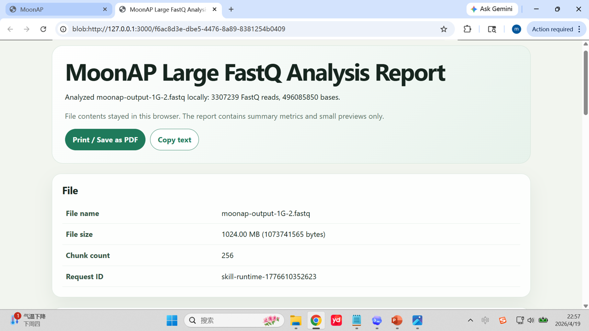
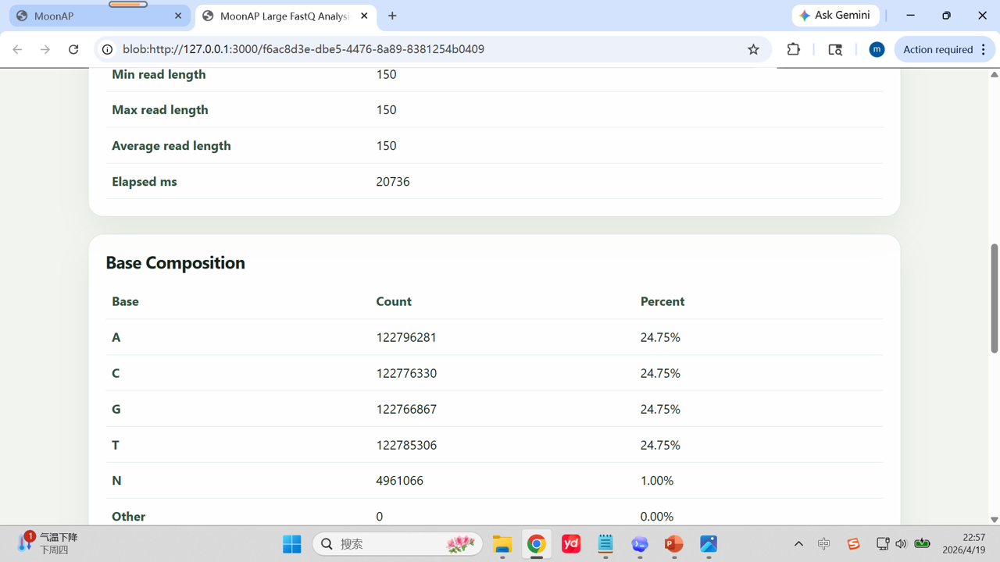

# MoonAP: MoonBit Agent Playground

MoonAP is a MoonBit Agent Playground for AI-generated WebAssembly programs in the browser.

Users describe an app in natural language. MoonAP routes the task to an LLM, receives MoonBit source code, compiles it to WebAssembly, and runs the result locally in the user's browser. Useful generated apps can be saved as reusable MoonAP SKILLs and run again without asking the LLM.

中文摘要：MoonAP 不是一个单一的 FastQ 工具，而是一个用 MoonBit 构建的通用 Agent Playground。它把“自然语言需求 -> LLM 生成 MoonBit 程序 -> 编译为 WebAssembly -> 浏览器本地运行 -> 保存为可复用 SKILL”串成一个完整平台。FastQ 大文件生成/分析是隐私保护与浏览器边端计算的代表性样例，CSV、JSON、文本分析和计算器类 APP 则展示了平台的通用能力。

MoonAP's core idea is:

```text
Natural-language task
-> LLM-generated MoonBit program
-> MoonBit compile to WebAssembly
-> browser-local execution
-> reusable MoonAP SKILL
```

The original project proposal used large FastQ analysis as the motivating example. The current project is broader: MoonAP is a general platform for generating, running, saving, installing, and reusing browser-local MoonBit apps.

## Screenshots







## Highlights

- **MoonBit-first agent platform**: the server, runtime orchestration, generated app source, and validation flow are built around MoonBit.
- **Browser-local execution**: generated WebAssembly apps run in Chrome/Edge, with user data processed locally where possible.
- **Privacy-preserving large-file workflows**: large FastQ generation and analysis use browser-local streaming/chunking. File contents are not uploaded to the LLM.
- **Reusable SKILL system**: successful apps can become MoonAP SKILLs and run later from local SKILL stores.
- **Three-layer SKILL architecture**: Personal, Local, and Cloud SKILL areas separate creation, local execution, and public discovery.
- **Generic runtime contracts**: form apps, text tools, JSON formatters, CSV analyzers, and calculators can be driven by embedded runtime specs instead of one-off UI code.
- **Real and simulated LLM routes**: Real API routes support providers such as NVIDIA, ZAI/GLM, Gemini, SiliconFlow, OpenRouter, and custom OpenAI-compatible endpoints; the Simulated GPT-5.4 route supports deterministic demos and regression tests.

## What Works in v0.1

The current v0.1 demo set covers 12 categories:

1. Celsius/Fahrenheit converter
2. Minutes/seconds converter
3. Two-number sum
4. BMI calculator
5. Circle area/circumference calculator
6. Loan payment calculator
7. Tip calculator
8. JSON formatter and validator
9. Text analyzer
10. CSV summary analyzer
11. Large FastQ generator
12. Large FastQ analyzer

The small utility apps use the generic runtime contract path. The FastQ generator/analyzer remain special high-value browser-local large-file workflows.

## Architecture at a Glance

```text
Browser UI
  |
  | natural-language task / runtime inputs
  v
MoonAP server
  |
  | LLM route: real provider or simulated GPT-5.4
  v
Generated MoonBit source
  |
  | moon build / wasm artifact
  v
Browser-local runtime
  |
  | result review / download / report
  v
MoonAP SKILL save and reuse
```

Large user files stay in the browser. MoonAP may send prompts, generated source code, metadata, and summary metrics through the local server, but it should not send large private file contents to the LLM.

## SKILL Model

MoonAP uses three SKILL layers:

- **Personal-SKILL-Set**: user-created local SKILLs saved from generated apps. These can run locally.
- **Local-SKILL-Hub**: installed public SKILLs. This is where public SKILLs actually run.
- **Cloud-SKILL-Hub**: public discovery and installation catalog. Cloud entries are install-only and should not run directly.

Public SKILLs are published as both a folder and a same-level ZIP file:

```text
demo/utilities/celsius-fahrenheit-converter/
demo/utilities/celsius-fahrenheit-converter.zip
```

The official Cloud SKILL-Hub is maintained in the separate repository:

```text
https://github.com/tangmaomao16/MoonAP-SKILL-Hub
```

## Prerequisites

The current release path is validated on Windows.

- Windows 10/11
- MoonBit toolchain with `moon` on `PATH`
- Visual Studio Build Tools or Visual Studio C++ workload for MSVC
- Chrome or Edge for File System Access API support
- Optional: real LLM API keys

Use the scripts in `tools\` for native server work. They load the MSVC environment and avoid common Windows linker/runtime issues.

## Fresh Clone Quick Start

From the repository root:

```cmd
tools\moon-msvc.cmd build cmd\web_app --target js
tools\restart-moonap-server.cmd
```

Open:

```text
http://127.0.0.1:3000/
```

Press `Ctrl+F5` in the browser after rebuilding.

The server prefers the built JS bundle under `_build`. If `_build` does not exist, it falls back to the committed distribution bundle:

```text
web/app-live.js
```

For release builds, keep these files synchronized with `cmd/web_app/main.mbt`:

```text
web/app-live.js
web/app.js
```

## LLM Configuration

Click `LLM` in the MoonAP UI.

- **Real API** is the public/default route. Configure a known provider or a custom OpenAI-compatible endpoint.
- **Simulated API** is the deterministic local/demo route. Enable `OpenAI / GPT-5.4 simulated` for repeatable v0.1 demonstrations.

Real lightweight/free models may not reliably generate valid MoonBit yet. For competition demos, the simulated route is the most stable internal path, while Real API support remains available for stronger external models and future work.

## Demo Prompts

After enabling a provider, try:

```text
Build an app where the user enters a Celsius temperature and gets the Fahrenheit temperature.
```

```text
Build a JSON formatter and validator.
```

```text
Build a text analyzer that counts characters, words, lines, and estimated reading time.
```

```text
Build a CSV analyzer that reports row count, column names, missing values, and numeric column summaries.
```

For large-file demos:

```text
Build a large FastQ file generator that creates a 1GB FASTQ file in the browser.
```

```text
Build a large FastQ analyzer that reads a FastQ file in chunks and reports read count, base count, A C G T N, read length, and malformed records.
```

## Validation Commands

Recommended v0.1 validation path:

```cmd
moon fmt
tools\moon-msvc.cmd build cmd\web_app --target js
node --check web\app-live.js
node --check web\app.js
tools\restart-moonap-server.cmd
powershell -ExecutionPolicy Bypass -File tools\test-demo-prompts.ps1
powershell -ExecutionPolicy Bypass -File tools\test-skill-flow.ps1
```

`moon info` and `moon test` are not currently the most reliable whole-project checks in this Windows setup. Known causes include JS externs in `cmd/web_app` under native checks and MinGW/MSVC friction in native async dependencies.

## Important Windows Notes

- Prefer `tools\restart-moonap-server.cmd`.
- Do not use `tools\start-moonap-bg.cmd` as the first choice during active development; it has previously caused confusing background-process hangs.
- If `server.exe` or `server.lib` is locked, inspect `Get-Process server` and confirm it is the local MoonAP server before stopping it.
- Real provider API failures can be caused by inherited proxy/TLS environment variables. If Simulated GPT-5.4 works but real providers fail before provider response, restart the server in a clean environment and re-test.

## Repository Layout

```text
cmd/server/        MoonAP local server
cmd/web_app/       MoonBit browser app compiled to JavaScript
web/               committed release JS bundle and browser assets
tools/             Windows build, restart, publish, and validation scripts
docs/              architecture notes, plans, experiments, and handoffs
fixtures/          small local test fixtures
```

## Release Notes for Competition Review

Start with:

- [SUBMISSION.md](SUBMISSION.md)
- [docs/README.md](docs/README.md)
- [docs/architecture/lightweight-task-runtime-abstraction.md](docs/architecture/lightweight-task-runtime-abstraction.md)
- [docs/architecture/moonap-skill-folder-spec.md](docs/architecture/moonap-skill-folder-spec.md)

## License

MoonAP is released under the Apache License 2.0. See [LICENSE](LICENSE).
